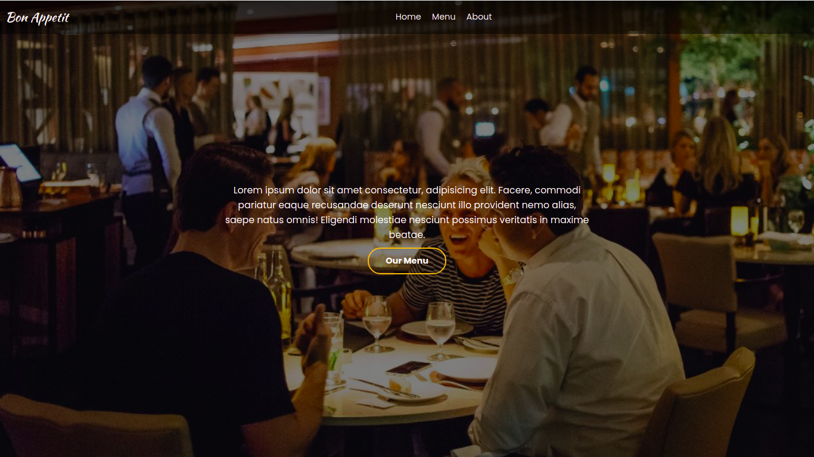

# Restaurant pages

## About the Project

This project uses Javascript to render all the elements of the page and responsibilities of rendering the different sections of the page are organized in separate module. Webpack is used to bundle the different modules in to main.js file under dist folder.

## Table of Contents

* [About the Project](#about-the-project)
* [Built With](#built-with)
* [Live Demo](#live-demo)
* [Authors](#authors)
* [Contributing](#contributing)
* [Show your support](#show-your-support)
* [License](#license)
* [Acknowledgements](#acknowledgements)

## Built With

* [JavaScript](https://en.wikipedia.org/wiki/JavaScript)
* [HTML5](https://en.wikipedia.org/wiki/HTML5)
* CSS

## Live Demo

[Live Demo Link](https://www.binyamhailemeskel.me/RestaurantPage/)

## Authors

👤 **Binyam Hailemeskel**

- GitHub: [@bini-i](https://github.com/bini-i)
- Twitter: [@binyamshewa](https://twitter.com/binyamshewa)
- LinkedIn: [binyam hailemeskel](https://www.linkedin.com/in/bini-i/)

## Contributing

Contributions, issues, and feature requests are welcome!
Feel free to check the [issues page](../../issues).

1. Fork the Project
2. Create your Feature Branch (`git checkout -b feature/AmazingFeature`)
3. Commit your Changes (`git commit -m 'Add some AmazingFeature'`)
4. Push to the Branch (`git push origin feature/AmazingFeature`)
5. Open a Pull Request

## Show your support

Give a ⭐️ if you like this project!

## License

This project is [MIT](./LICENSE) licensed.

## Acknowledgements
* [The odin project](https://theodinproject.com)
* [Microverse](https://www.microverse.org/)
* [MDN Web docs](https://developer.mozilla.org/)

